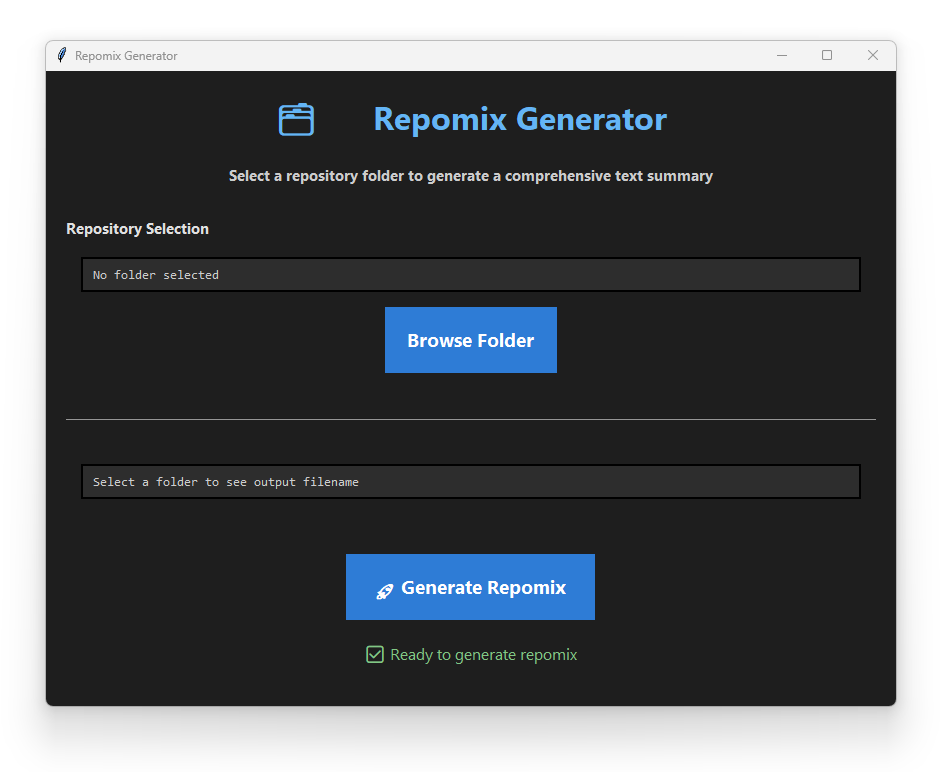

# Repomix GUI

A GUI wrapper that provides a user-friendly interface for [Repomix](https://github.com/yamadashy/repomix). This is only
a GUI wrapper and you must have Node installed to use it.

This was a 45 minute AI assisted, quick and dirty project to make AI assisted coding easier. When using AI to code
something, I will often feed a Repomix file of my codebase for analysis, feedback or to have the AI model make some
changes. This makes it a little easier to accomplish.



## 📥 Download (For Most Users)

**Just want to use the app?**

This app is a standalone exe and does not need to be installed.

-   Go to [Releases](https://github.com/yourusername/repomix-gui/releases)
-   Download `repomix-gui.exe` from the latest release
-   Double-click to run (requires Node.js for Repomix)

## 🚧 Issues

These may or may not be fixed, depending on how often they come up. The fix might even be to not use this GUI and just use Repomix in the terminal as originally intended. If you enounter frequent errors, please submit an issue on it.

-   This app uses Tkinker in the GUI which may not be installed or configured in all Python installations.
-   Error reporting is broken and incomplete.
-   If this program runs for a long time, the GUI may freeze. This has not happened in initial testing so no fix has has
    been explored yet.
-   env and log files are hardcoded to be ignored. This really shouldn't be much of an issue but the fact it is not configureable should be noted.

## 🛠️ For Developers

### Run from Source

It is intended to to be used by running the .exe, but you can run the .py file directly if you prefer. Simply save the repomix_gui.py file to your PC, navigate to that folder and run the following command in the terminal.

```
python repomix_gui.py
```

### Build and Customize Your Own Executable

If you want to make changes to the program, edit the repomix_gui.py file and then make the executable by running.

```
pip install pyinstaller
pyinstaller --onefile --windowed repomix_gui.py
```

## Requirements

-   Node.js and npm (needed to run Repomix)
-   Python 3.6+ (only if running from source, not needed to run the .exe)

## License

This project is licensed under CC BY-NC-SA 4.0
